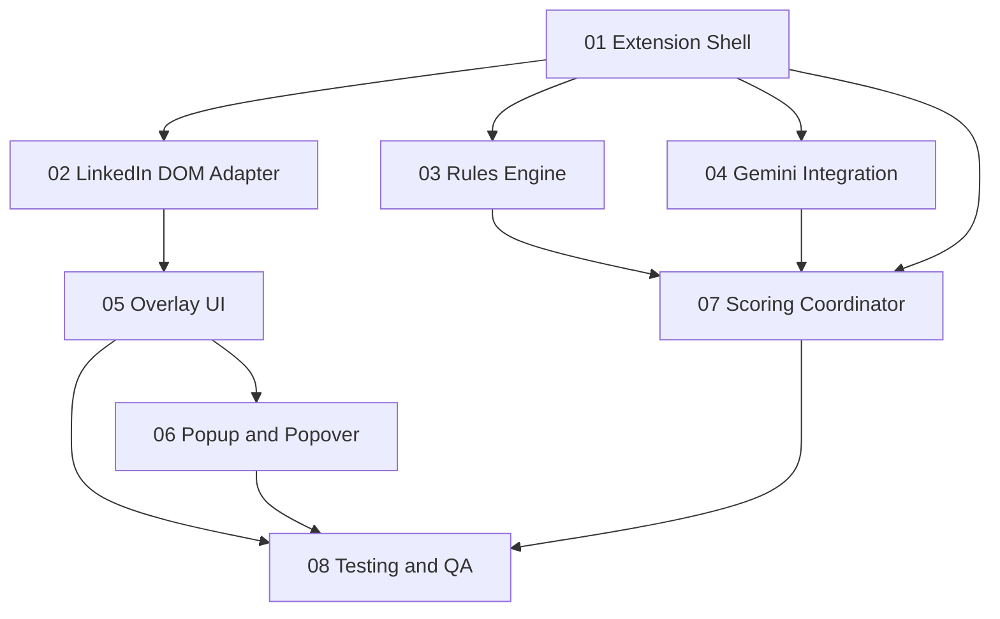

# Execution Sequence and Dependencies

## Dependency Graph



## Phases

### Phase 0 (Blocking Foundation)

| Plan | Description | Blocks |
|------|-------------|--------|
| 01 Extension Shell | Manifest V3, Vite, Preact, messaging, service worker, content script entry | Everything |

### Phase 1 (Parallel after Phase 0)

| Plan | Description | Depends On |
|------|-------------|------------|
| 02 LinkedIn DOM Adapter | Post/comment detection, text extraction, element refs | 01 |
| 03 Rules Engine | Deterministic scoring, feature extraction, golden set | 01 (shared types only) |
| 04 Gemini Integration | Offscreen document, Prompt API, session management | 01 |

All three can run in parallel once 01 is complete.

### Phase 2 (Parallel after Phase 1 dependencies)

| Plan | Description | Depends On |
|------|-------------|------------|
| 05 Overlay UI | Sticker renderer, position sync, observer layer | 01 + 02 |
| 06 Popup and Popover | Inline explanation popover, popup settings/status | 01 + 05 |
| 07 Scoring Coordinator | Cache, mode switching, queue, messaging integration | 01 + 03 + 04 |

05 and 07 can run in parallel. 06 starts once 05 is done.

### Phase 3 (Final)

| Plan | Description | Depends On |
|------|-------------|------------|
| 08 Testing and QA | Integration tests, failure modes, privacy, release prep | All above |

## Parallel Execution Summary

At maximum parallelism, 3 agents can work simultaneously during Phase 1.

```
Week 1:       [01 Extension Shell]
Week 2-3:    [02 DOM Adapter] [03 Rules Engine] [04 Gemini]
Week 3-4:    [05 Overlay UI] [07 Scoring Coordinator]
Week 4-5:    [06 Popup & Popover]
Week 5-6:    [08 Testing and QA]
```

## Integration Gates

Before moving to the next phase, verify:

- **Gate 1 (after 01):** Extension loads in Chrome, content script injects on LinkedIn, service worker starts, messaging roundtrip works, popup opens.
- **Gate 2 (after Phase 1):** DOM adapter finds posts/comments on saved HTML fixtures, rules engine passes golden set at 80%+ agreement, Gemini session creates successfully in offscreen document AND returns valid parseable JSON for at least 3 test items, user gesture forwarding path is confirmed working.
- **Gate 3 (after Phase 2):** Stickers appear positioned over LinkedIn posts, inline popover opens on sticker click, scoring coordinator routes items through correct mode, popup shows settings and model status.
- **Gate 4 (after 08):** End-to-end Playwright tests pass, failure modes verified, privacy disclosure reviewed.

## Removed from MVP

- **Filter mode (dim/hide/collapse):** Deferred to post-MVP. Requires LinkedIn DOM mutation which contradicts the overlay-only principle. Highlight via overlay border may be added later as a low-risk option.
