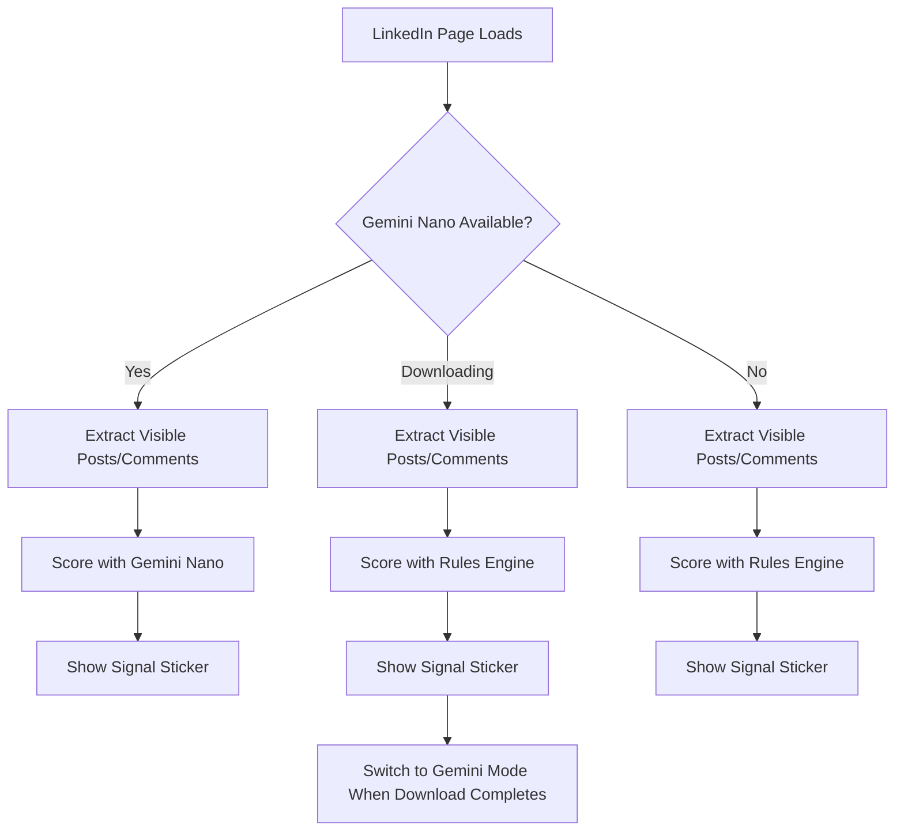
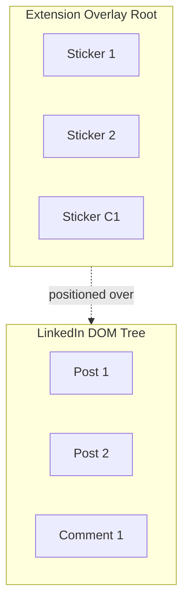
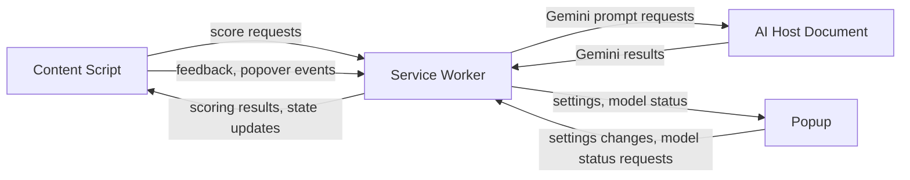
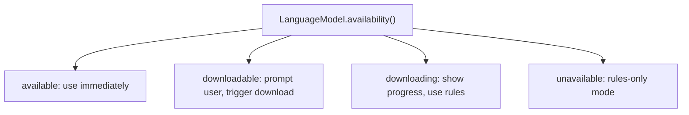

# Architecture: Local-First Chrome Extension

## Table of Contents

1. Summary
2. Product Constraints
3. Technology Stack
4. Runtime Flow
5. UI Injection: Overlay Root
6. Messaging Architecture
7. Extension Modules
8. Gemini Nano Integration
9. Scoring System
10. Filter Mode (Post-MVP)
11. Concurrency and Scheduling
12. Failure Modes
13. Privacy Model
14. Performance Strategy
15. Testing Strategy
16. Scope Constraints
17. Build Phases
18. Open Questions
19. Appendix: Implementation Agent Split

---

## 1. Summary

A fully local Chrome extension that analyzes visible LinkedIn posts and comments and renders private Signal Stickers explaining content quality.

Core architecture principle:

> Rules until Gemini is ready. Gemini once available.

The extension uses two scoring modes, but only one is active at a time:

1. **Rules mode:** A deterministic rules engine provides instant scoring before Gemini Nano is downloaded and available.
2. **Gemini mode:** Once Gemini Nano is available, it becomes the primary scoring engine. The rules engine is only invoked as a per-item fallback when Gemini fails for a specific item.

No backend is required. All inference happens locally. No score reconciliation is needed because only one scoring system runs per item (Gemini first; rules only on Gemini failure).

## 2. Product Constraints

From the PRD:

- Avoid binary claims such as "this was written by AI."
- Score content instances, not people.
- Keep labels private to the extension user.
- Minimize data collection; do not store full feed history.
- Do not automate LinkedIn engagement.
- Do not break LinkedIn page behavior.
- Keep browsing performance acceptable.
- Provide transparent explanations, not opaque verdicts.

## 3. Technology Stack

**Extension platform:** Chrome Extension Manifest V3, WXT framework, TypeScript, Vite, Preact.

**UI surfaces:**

- Overlay root with scoped CSS for inline stickers and explanation popovers on LinkedIn.
- Extension popup for quick toggles, settings, clear-data controls, and AI model status.
- Optional future Chrome side panel for diagnostics or deeper analysis; not required for MVP.

**Local AI:**

- Primary: Chrome Prompt API / `LanguageModel` / Gemini Nano.
- Fallback: deterministic TypeScript rules engine.
- Future option: WebLLM with Qwen2.5-1.5B-Instruct (only if Prompt API availability becomes a blocker).

**Storage:**

- `chrome.storage.local` for settings, model state, and small cache entries.
- IndexedDB for larger caches and weekly aggregates.
- Store content hashes and labels, not raw LinkedIn text.

## 4. Runtime Flow



Only one scoring engine is active at a time. The extension never blocks LinkedIn browsing while AI is initializing or downloading.

## 5. UI Injection: Overlay Root

### Decision

Use a single fixed-position overlay element appended to the document body. All stickers are children of this overlay, positioned above their corresponding LinkedIn elements.

LinkedIn's DOM remains untouched: the extension reads it but does not insert children into it.



### Rationale

**Platform safety:** LinkedIn can detect child nodes injected into their component tree via their own MutationObservers. The overlay adds only one top-level body sibling and does not trigger internal DOM integrity checks.

**CSS isolation:** The overlay sits in its own stacking context. No CSS leaks in either direction. No Shadow DOM complexity required.

**Layout safety:** Overlay elements do not participate in LinkedIn's layout. Sticker additions and removals cannot cause LinkedIn reflows.

### Alternatives Considered

- **Shadow DOM + inline injection:** Good CSS isolation, but still injects into LinkedIn's tree.
- **Plain DOM injection:** Simplest, but highest detection risk.
- **Iframe injection:** Strongest isolation, too heavy for many small stickers.
- **Side panel only:** Safest, but no inline feed context.

### Position Synchronization

- Batch all `getBoundingClientRect()` reads at the start of each `requestAnimationFrame` callback before any writes (read/write separation invariant).
- Update sticker positions with `transform: translate(x, y)` (compositing-only, no reflow).
- Use `IntersectionObserver` to activate/deactivate stickers entering/leaving the viewport.
- Use `MutationObserver` to detect new feed items and clean up removed ones.
- Cap tracked stickers at approximately 50.

Cost: under 1ms per frame for 15 stickers, well within the 16ms budget at 60fps.

### Platform Safety Rules

- Analyze only content the user has already loaded.
- Never auto-scroll, auto-click, or auto-expand.
- Never send messages, comments, reactions, or connection requests.
- Never use LinkedIn private APIs or scrape in the background.
- Never create person-level public scores.
- Fail gracefully if LinkedIn changes (see section 12).

## 6. Messaging Architecture

### Context Responsibilities



**Content script:** DOM detection, overlay rendering, position sync. Runs on LinkedIn pages.

**Service worker (background):** Central coordinator. Owns the scoring coordinator, item registry, cache, and message routing. Stateless between terminations; recovers from IndexedDB/storage on wake.

**AI host document (offscreen document):** Hosts Gemini Nano `LanguageModel` sessions. Chosen because it persists independently of whether any user-visible extension UI is open. A side panel is only a technical fallback if offscreen document hosting is unavailable or incompatible with the Prompt API.

**Inline popover:** User-facing explanation display. Rendered by the content script inside the extension overlay root when the user clicks a sticker.

**Popup:** Quick toggles, settings, clear-data controls, and model status. No long-lived state.

### Message Protocol

All messages use a typed request/response protocol over `chrome.runtime.sendMessage` and `chrome.runtime.onMessage`.

```typescript
type MessageType =
  | { type: 'SCORE_BATCH'; items: ExtractedItem[] }
  | { type: 'SCORE_RESULT'; results: ScoringResult[] }
  | { type: 'GEMINI_PROMPT'; item: ExtractedItem }
  | { type: 'GEMINI_RESULT'; result: ScoringResult }
  | { type: 'SHOW_EXPLANATION'; itemId: string }
  | { type: 'SETTINGS_CHANGED'; settings: Partial<UserSettings> }
  | { type: 'FEEDBACK'; itemId: string; feedback: FeedbackType }
  | { type: 'MODEL_STATUS'; status: GeminiStatus }
```

All messages are request/response (sendMessage with callback/promise). No fire-and-forget for scoring. Streaming is not used for MVP; Gemini results are awaited in full before returning.

### Service Worker Lifecycle

MV3 service workers can be terminated by Chrome at any time. Design for this:

- **No in-memory-only state.** The item registry and scoring queue persist to IndexedDB. On wake, the service worker rebuilds state from storage.
- **In-flight Gemini work:** If the service worker is terminated while waiting for a Gemini result from the offscreen document, the offscreen document completes independently and caches the result. On next wake, the service worker checks for completed results.
- **Content script reconnection:** Content scripts detect service worker disconnection via port closure. On reconnection, they re-send any pending score requests.
- **Offscreen document lifecycle:** The service worker creates the offscreen document on first Gemini request and keeps it alive via `chrome.offscreen.createDocument`. If Chrome closes it, the service worker recreates it on next Gemini request.

### Inline Popover Synchronization

- When the user clicks a sticker, the content script opens an inline popover anchored to that sticker.
- If the content script already has the scoring result in its local item registry, it renders the explanation immediately.
- If explanation data is missing or stale, the content script sends `SHOW_EXPLANATION` to the service worker and renders the result when returned.
- Opening a new popover closes any existing popover.
- Clicking outside the popover, pressing Escape, or scrolling the item out of view closes the popover.
- Gemini scoring does **not** depend on the popover, popup, or side panel being open. The offscreen document handles AI independently.

## 7. Extension Modules

### 7.1 Content Script

Owns page-level coordination:

- Detects visible posts and comments via the DOM adapter.
- Manages the overlay root element (the only element appended to the body).
- Coordinates sticker positioning via the observer layer.
- Sends score requests to the service worker.

### 7.2 LinkedIn DOM Adapter

Isolated, brittle module responsible for LinkedIn-specific DOM knowledge:

- Finds post and comment containers.
- Extracts visible text.
- Provides element references for overlay tracking.
- Detects element recycling during infinite scroll.
- Prefers ARIA/accessibility attributes over unstable class names.
- Supports defensive fallback selectors.

### 7.3 Observer Layer

- `MutationObserver` for new feed items and removed elements.
- `IntersectionObserver` for viewport-based sticker activation and scoring priority.
- `ResizeObserver` for layout changes affecting sticker positions.
- `requestAnimationFrame` scroll loop for position updates (read/write separated).
- Debounced batching before scoring.

### 7.4 Item Registry

Tracks each item through its lifecycle:

- Discovered, extracted, rules-scored, gemini-queued, gemini-scored, sticker-active, sticker-inactive, failed.
- Deduplicates by normalized text hash.
- Cleans up stickers when LinkedIn removes or recycles DOM nodes.
- Persisted to IndexedDB for service worker recovery.

### 7.5 Scoring Coordinator

Lives in the service worker. Operates in one of two modes:

**Rules mode** (Gemini not yet available):

1. Check local cache (including `scoringVersion` match).
2. If no valid cached result, run rules engine.
3. Return result to content script.

**Gemini mode** (Gemini available):

1. Check local cache (including `scoringVersion` match).
2. If no valid cached result, send to Gemini via offscreen document.
3. Return result to content script.

Mode switch: when Gemini becomes available (download completes or session is first created), the coordinator switches to Gemini mode permanently for the session. Previously cached rules-based scores remain valid until their TTL expires or `scoringVersion` changes; they are not re-scored proactively.

### 7.6 Signal Sticker Renderer

Overlay root setup:

- `position: fixed`, full viewport, `pointer-events: none`, high `z-index`.
- Individual stickers have `pointer-events: auto`.
- Stickers include `role="status"` and `aria-label` for screen reader accessibility.
- Stickers are keyboard-focusable (`tabindex="0"`) for keyboard-only users.

Sticker behavior:

- Color plus text label.
- States: loading, labeled, unclear, unavailable.
- Positioned with `transform: translate(x, y)`.
- Clicking opens an inline explanation popover anchored near the sticker.
- Post and comment stickers toggleable separately.

### 7.7 Inline Explanation Popover

Shows on sticker click:

- Primary label and confidence.
- Top 2-3 reasons.
- Optional dimension scores.
- Scoring source indicator (rules or gemini).
- Feedback: Agree, Disagree, Not Useful.

A hover tooltip on the sticker may show a one-sentence reason without opening the popover.

Popover behavior:

- Rendered inside the overlay root, not inside LinkedIn's DOM tree.
- Opens next to the clicked sticker and attempts to stay within the viewport.
- Only one popover is open at a time.
- Closes on outside click, Escape, or when the anchored item leaves the viewport.
- Uses `pointer-events: auto`; the overlay root remains `pointer-events: none`.
- If positioning fails, the popover closes rather than covering LinkedIn controls unpredictably.

### 7.8 Settings

Lives in the extension popup for MVP. Controls:

- Sticker visibility (all, posts only, comments only, off).
- Strictness (low, medium, high).
- Weekly summaries toggle.
- Advanced local AI enablement and status.
- Clear cache / delete all data.

Optional future side panel:

- Diagnostics
- Detailed score history
- Saved insights workspace
- Team or creator analytics

## 8. Gemini Nano Integration

### Availability Detection



The extension does not install Gemini Nano. It asks Chrome whether the built-in model is available and triggers Chrome's managed download after a user gesture.

User-facing framing: "Enable private on-device analysis."

Before triggering download, the extension should communicate storage requirements: "This requires approximately 2GB of free space for Chrome's on-device AI model."

### Prompt API Constraints

- Model downloads separately on first use (requires 22GB+ total free space on Chrome profile volume, 4GB+ VRAM or 16GB+ RAM).
- Availability depends on Chrome version and device capability.
- Must be capability-detected at runtime; never assumed present.
- Sessions run in the offscreen document when possible, not in the service worker or content script.
- If offscreen document hosting is incompatible with the Prompt API, evaluate another extension document. A side panel is a technical fallback only, not a required MVP user surface.

### Gemini Scoring Behavior

- Once available, Gemini is the primary scorer for all new items.
- Handles all classification: nuanced/mixed cases, obvious cases, explanations, originality judgment, and confidence calibration.
- Output constrained to strict JSON schema via `responseConstraint`; invalid responses trigger the repair strategy (see section 12).
- If Gemini fails for a specific item after repair/retry, the scoring coordinator falls back to the rules engine for that item only. The global mode remains Gemini.
- MVP: 1 concurrent Gemini session. Benchmark before increasing.

## 9. Scoring System

### Shared Contract

Both rules and Gemini return the same shape:

```json
{
  "itemId": "hash-based-local-id",
  "itemType": "post",
  "primaryLabel": "Specific",
  "color": "green",
  "confidence": "medium",
  "dimensions": {
    "authenticity": 0.74,
    "originality": 0.68,
    "specificity": 0.82,
    "engagementBait": 0.15,
    "templating": 0.20,
    "usefulness": 0.71
  },
  "reasons": [
    "Includes concrete work context and a specific example.",
    "Avoids broad motivational phrasing."
  ],
  "source": "rules",
  "scoringVersion": 1,
  "createdAt": 1714956000000
}
```

`confidence` is a categorical string (low/medium/high) because it is user-facing in the explanation popover. `dimensions` are numeric floats (0-1) because they are used internally for threshold logic and are only optionally shown to users.

### Label Taxonomy

Post labels: High Signal, Specific, Mixed, Generic, Engagement Bait, Low Signal, Unclear.

Comment labels: Thoughtful, Specific, Question, Generic, Low Effort, Repeated, Unclear.

Color mapping: green (high signal), yellow (mixed), orange (generic/templated), red (engagement bait/very low signal), gray (unclear/low confidence).

Never use: AI-generated, Fake, Bot, Fraud, Human Verified.

### Rules Engine

Active only when Gemini is unavailable. Handles scoring with deterministic feature extraction:

- Text length, sentence count, first-person language.
- Concrete numbers, dates, percentages, named entities.
- Generic praise phrases, motivational cliches, engagement-bait patterns.
- Listicle structure, claim/evidence ratio.
- Repeated comment similarity.

Conservative: prefers Unclear over overconfident negative labels for ambiguous content. In Gemini mode, the rules engine is only invoked as a per-item fallback when Gemini fails.

### Gemini Enhancement

Once available, Gemini is the sole scorer. It provides:

- Nuanced classification for mixed-signal content.
- Richer explanations with specific reasoning.
- Better distinction between polished-generic and genuinely specific writing.
- Higher-quality comment classification.
- Confidence calibration.

### Mode Transition

When Gemini becomes available mid-session (download completes while user is browsing):

- New items are scored by Gemini from that point forward.
- Items already showing rules-based stickers are **not** re-scored. Their stickers remain until the item scrolls away and the cache entry expires naturally.
- No reconciliation logic is needed. No sticker flicker occurs.

### Cache Versioning

- Every cached score includes a `scoringVersion` integer.
- When the rules engine or Gemini prompt changes, increment `scoringVersion`.
- On cache lookup, reject entries with a stale `scoringVersion`. This triggers fresh scoring.
- Extension updates that change scoring logic must bump the version.

## 10. Filter Mode (Post-MVP)

Filter mode (dim, hide, collapse) is deferred to post-MVP because it requires mutating LinkedIn's DOM or element styles, which contradicts the overlay-only approach and increases detection risk.

The MVP provides signal labels and explanations only. It does not modify the visual presentation of LinkedIn posts.

**Highlight** is the one exception that could be added to MVP if needed: rendering a colored border element in the overlay positioned around high-signal posts requires no LinkedIn DOM mutation. This is optional and not part of the initial build.

Post-MVP filter mode would involve inline style mutations on LinkedIn elements (`opacity`, `display`, `max-height`). This carries platform detection risk and would be off by default, user-controlled, and reversible. Design details will be specified if user research confirms demand for feed manipulation beyond labeling.

## 11. Concurrency and Scheduling

### Scoring Queue

The scoring coordinator maintains a priority queue:

- **Priority 1:** Items currently in viewport.
- **Priority 2:** Items near viewport (within 1 screen height above/below).
- **Priority 3:** Items that scrolled out of viewport but have no cached score.

### Viewport-Based Cancellation

- **Rules mode:** When an item leaves the viewport before rules scoring completes, let it finish (it is fast and the result is cached).
- **Gemini mode:** When an item leaves the viewport before Gemini scoring completes, cancel the request if inference has not started. If inference is in-flight, let it finish and cache the result (cost is already paid).

### Rapid Scroll Handling

During fast scrolling, many items enter and exit the viewport quickly:

- Debounce new item discovery by 150ms. Only items still visible after the debounce interval are queued for scoring.
- If the queue exceeds 20 pending items, drop lowest-priority items.
- Never queue more than 1 Gemini request while scrolling rapidly. Resume normal Gemini throughput when scroll velocity drops.

### Deduplication

- Items with the same content hash share a single scoring result.
- If item A is being scored and item B arrives with the same hash, item B waits for A's result rather than starting a duplicate request.
- In-flight tracking uses a `Map<contentHash, Promise<ScoringResult>>` in the service worker.

## 12. Failure Modes

### Failure Mode Table

| Scenario | Detection | Recovery | User Impact |
|----------|-----------|----------|-------------|
| DOM adapter cannot find post containers (LinkedIn redesign) | Adapter returns zero matches for 3+ consecutive observations | Disable stickers, show "LinkedIn layout not recognized" in popup, log locally for diagnostics | Extension becomes passive; no stickers shown |
| Extension messaging fails (service worker terminated mid-request) | Content script port `onDisconnect` fires | Content script reconnects and re-sends pending requests; service worker rebuilds state from IndexedDB on wake | Brief delay; sticker appears after reconnection |
| Gemini returns invalid JSON | JSON parse fails or schema validation rejects response | Retry once with simplified prompt. If retry fails, keep rules-based score and mark `geminiAttempted: true` to avoid infinite retries | User sees rules-based label; explanation notes "enhanced analysis unavailable" |
| Gemini session crashes repeatedly | 3 consecutive session creation failures within 5 minutes | Disable Gemini for the session, fall back to rules-only, show model error in popup | Rules-only mode; user informed |
| IndexedDB quota exceeded | `QuotaExceededError` on write | Evict oldest 25% of cache entries and retry write. If still failing, switch to in-memory cache for session | No user-visible impact beyond slower cold start next session |
| Content script injection blocked by LinkedIn CSP changes | Content script fails to execute | Extension detects no heartbeat from content script; shows "unable to analyze this page" in popup | Extension non-functional on affected pages |
| `getBoundingClientRect` returns zero-rect (element hidden or removed) | Rect width/height is 0 | Remove sticker from overlay, mark item as sticker-inactive in registry | Sticker disappears cleanly |
| Gemini model unavailable after previously working | `LanguageModel.availability()` returns `unavailable` after prior `available` state | Switch to rules-only mode, notify user via popup that enhanced analysis is temporarily unavailable | Graceful degradation |

### General Recovery Principles

- Never crash the extension or break LinkedIn over a failure.
- Prefer degraded functionality over no functionality.
- Surface errors in the popup, never inline on LinkedIn.
- Log failure counts locally for the health monitor.

## 13. Privacy Model

- All processing happens on-device. No backend required.
- Store content hashes and scores, not raw LinkedIn text.
- Score cache: default TTL of 14 days, configurable by user. Cap at 10,000 entries.
- Saved insights: opt-in only, stored locally.
- Users can clear all local data at any time.
- Weekly summaries use local aggregate counters only.
- Opt-in anonymous telemetry may be added post-MVP for adapter health monitoring (see section 15).

## 14. Performance Strategy

### Overlay Rendering

Under 1ms per frame for typical feed (see section 5). Uses compositing-only updates; does not affect LinkedIn layout. Read/write separation is a hard invariant: all `getBoundingClientRect` calls happen before any style writes in each rAF callback.

### LLM Inference

- In rules mode, scoring is instant (synchronous feature extraction).
- In Gemini mode, scoring is asynchronous. Stickers show a loading state until Gemini returns.
- MVP: 1 concurrent Gemini session. Benchmark on target devices before increasing.
- Reuse sessions; destroy idle ones after 60 seconds of no prompts.

### Feed Observation

- Debounce MutationObserver callbacks (150ms).
- Batch items before scoring.
- Ignore mutations outside supported containers.
- Use IntersectionObserver to limit work to visible items.

### Storage

- Cache by hash, not raw content.
- Cap at 10,000 entries; evict by age.
- Provide manual clear-cache control.

### Principle

The extension should feel invisible in terms of page performance. Show rules-based stickers immediately; upgrade with Gemini in the background.

## 15. Testing Strategy

Testing is continuous from Phase 1, not deferred to the end.

### DOM Adapter Testing

- Maintain a suite of saved LinkedIn HTML fixtures (feed page, post detail, comment thread, profile activity).
- Fixtures are captured from real LinkedIn pages and anonymized.
- Tests verify that the adapter correctly identifies post/comment containers and extracts text.
- On each LinkedIn breakage report, add the new HTML structure as a fixture and fix the adapter.
- Run fixture tests on every build.

### Rules Engine Testing

- Golden-set evaluation: a curated set of 100+ posts/comments with expected labels.
- Each rules engine change must pass the golden set with at least 80% agreement.
- New rules require adding corresponding test cases.
- Run on every build.

### Gemini Prompt Testing

- Maintain a golden set of 50+ items with expected labels.
- Run prompt evaluation offline against the golden set when prompts change.
- Track label agreement rate, invalid JSON rate, and average latency.
- Prompt changes require passing the golden set before merge.

### Integration Testing

- Use Puppeteer or Playwright to load the extension on a saved LinkedIn page fixture.
- Verify stickers appear, positioning is correct, and inline popover opens on click.
- Verify extension does not mutate LinkedIn DOM (overlay-only invariant).
- Run on CI for each release candidate.

### Health Monitoring (Post-MVP)

- Local-only health log: adapter success/failure rate, scoring latency, Gemini availability, error counts by page type.
- Visible in the popup for MVP, or in a future side panel diagnostics section if the product needs a larger debugging surface.
- Optional opt-in anonymous telemetry for aggregate adapter breakage detection.

## 16. Scope Constraints

Explicitly stated MVP limitations:

- **English only.** The rules engine's pattern matching (motivational cliches, engagement-bait phrases, generic praise) targets English-language content. Non-English posts receive Unclear or are deferred to Gemini if available.
- **Desktop Chrome only.** Mobile browsers and non-Chrome browsers are not supported.
- **No backend.** No server, no cloud LLM, no analytics backend.
- **No team features.** No shared workspaces, dashboards, or admin controls.
- **No integrations.** No CRM, ATS, or social listening platform connections.
- **No billing.** Free during validation. Billing added only after proving retention and willingness to pay.
- **No filter mode.** MVP does not dim, hide, or collapse LinkedIn posts. The extension labels content with stickers and explanations but does not modify LinkedIn's DOM or element styles. Filter mode may be added post-MVP if user research confirms demand.
- **No required side panel.** MVP explanations use inline popovers; the popup owns settings and model status. A side panel may be added later for diagnostics or deeper workflows.
- **Accessibility baseline.** Stickers include ARIA attributes (`role="status"`, `aria-label`). Stickers are keyboard-focusable. Popovers and popup controls are keyboard-navigable. Does not aim for WCAG AAA compliance in MVP but must not be inaccessible.
- **Extension size.** Target under 1MB packaged (excluding Chrome-managed Gemini Nano model). Monitor Chrome Web Store size limits.

## 17. Build Phases

**Phase 1 -- Extension Foundation (1 week):** Manifest V3, TypeScript/Vite, Preact UI, content script, overlay root, service worker, messaging layer, basic settings storage. Includes initial test harness.

**Phase 2 -- LinkedIn DOM Adapter (1 week):** Post/comment detection, text extraction, element references for overlay tracking, dynamic feed handling. HTML fixture test suite from day one.

**Phase 3 -- Rules-Only MVP (1-2 weeks):** Rules engine with golden-set tests, scoring contract, sticker rendering with accessibility, inline explanation popover.

**Phase 4 -- Gemini Integration (1-2 weeks):** Availability detection, onboarding flow, offscreen document hosting, popup model status/download progress, structured JSON prompts with repair strategy, score reconciliation, golden-set prompt evaluation.

**Phase 5 -- Persistence and Polish (1 week):** Local score cache with versioning, weekly aggregates, saved insights, clear-data controls, health monitoring.

**Phase 6 -- Integration Testing and Safety (1 week):** End-to-end Playwright tests, failure mode verification, privacy disclosure, Chrome Web Store preparation.

Estimated total: 6-9 weeks for one developer with AI coding assistance.

## 18. Open Questions

### Blocking (must prototype before finalizing)

1. Which extension context most reliably hosts Prompt API sessions for Chrome Web Store distribution? Prototype offscreen document first, then another extension document if needed; side panel is a technical fallback only.
2. Can Gemini Nano produce reliable structured JSON via `responseConstraint`, or is a repair/retry loop required? Benchmark invalid JSON rate on 50+ test cases.

### Important (answer during implementation)

3. How quickly can Gemini Nano score LinkedIn content on average target devices?
4. How stable are LinkedIn DOM selectors across feed, detail, and profile pages?
5. What is the right cache size limit before IndexedDB performance degrades?
6. How does the extension handle LinkedIn A/B tests that change DOM structure for subsets of users?
7. What is the maximum acceptable extension size for Chrome Web Store?
8. How will extension updates be handled without losing user settings or cached data?

## 19. Appendix: Implementation Agent Split

This section is for execution planning and can be extracted into a separate document.

**Extension Shell Agent:** Manifest V3 setup, Vite/TypeScript config, Preact foundation, content script entry, service worker, offscreen document, popup entry, messaging protocol implementation.

**LinkedIn Adapter Agent:** Post/comment detection, text extraction, DOM observation, element references, deduplication, HTML fixture test suite.

**Rules Engine Agent:** Feature extraction, label mapping, dimension scoring, explanations, scoring contract, golden-set test suite.

**Gemini Integration Agent:** Availability detection, user-activated enablement, offscreen document hosting, download progress, session lifecycle, JSON prompts, repair strategy, result validation, golden-set prompt evaluation.

**UX Agent:** Sticker component with accessibility, inline explanation popover, popup settings UI, model status UI, feedback controls.

**QA and Privacy Agent:** Data retention review, clear-data behavior, failure-mode verification, integration tests, Chrome compatibility, privacy disclosure copy, health monitoring.
